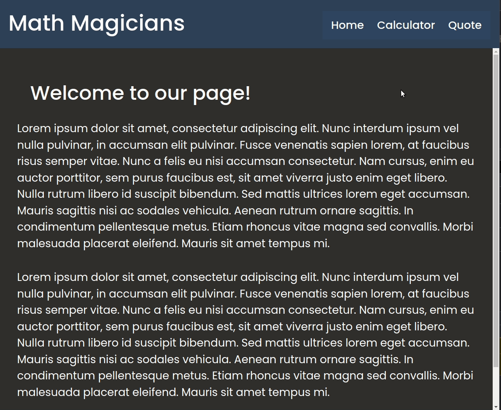
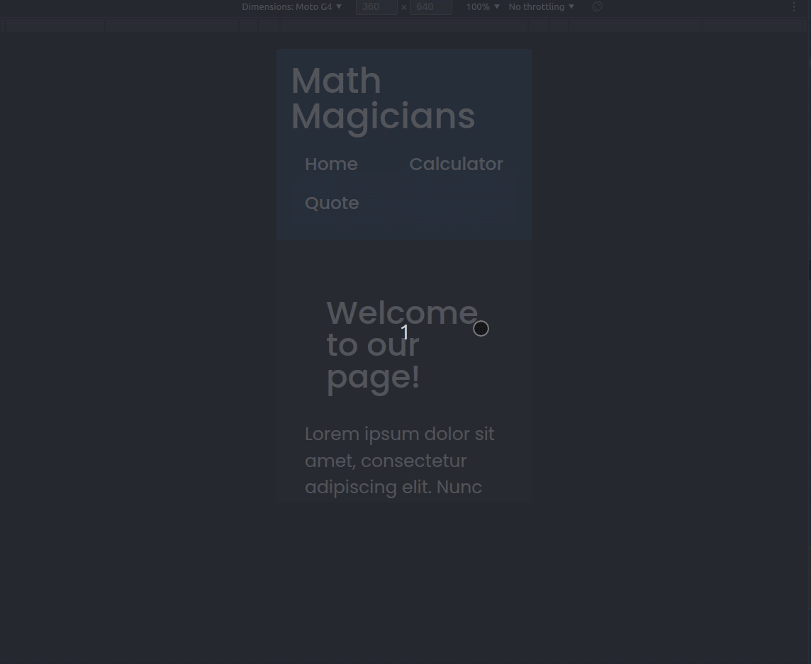

# Math Magicians

> Math Magicians is the first React Project I'm building. The main objective of this is to understand React features with a project-based learning approach. This is using them directly 




Math Magicians! This is a website for all fans of mathematics. It is a Single Page App (SPA) that allows users to make basic calculations and read a random math-related quote. 

## Built With

- HTML/CSS and JavaScript
- React Framework
- Visual Studio Code

## Live Demo

[Heroku Live Demo Link](https://jfmath-magicians.herokuapp.com/)
<br/>
[Netlify Live Demo Link](https://jfmath-magicians.netlify.app/)


## Getting Started

To get a local copy up and running follow these simple example steps.

- Clone this repository with git clone```https://github.com/JohnFTitor/math_magicians.git``` using your terminal or command line.
- Change to the project directory by entering : <br>
```cd math_magicians``` in the terminal

### Prerequisites

You need to make sure to have installed the latest version of Node.js and npm on your computer.

### Setup

You can clone this repository or simply download the files as a .zip
If you want to set up a personal repository based on this one, you can as well fork it.

### Install

After clone it and before working on it, you have to run ```npm install``` so that all the dependencies of the project get downloaded in your pc locally.
Such dependencies include React app and linters checks, for which you have to install the files following the ```wget``` commands inside linters.yml file.   
   
### Usage

You're free to use this project however you like it for educational purposes. Just keep in mind the acknowledgment described below

To work on the project, run ```npm start``` in your terminal to deploy a live version of the development. This works in watch mode so it automatically reloads any need change you make to the files. 

### Run linters checks

Linter Checks are automatically run with Github actions when there's a pull request. If you want to run them locally, remember to have the config file in the root of the local project. 

### Deployment

The deployment can be found in through any of the links provided above

## Authors

👤 **Andrés Felipe Arroyave Naranjo**

- GitHub: [@JohnFTitor](https://github.com/JohnFTitor)
- Twitter: [@johnftitor](https://twitter.com/johnftitor)
- LinkedIn: [Andres](https://www.linkedin.com/in/andresfelipe117/?locale=en_US)

## Acknowledgments

Here's a [link](https://github.com/arcanemutterings/random-quote-generator-api) to the API GitHub Repo from which I got the data for the quotes. Special thanks to the author!

## Show your support

Give a ⭐️ if you like this project!

## 📝 License

This project is [MIT](./MIT.md) licensed.
